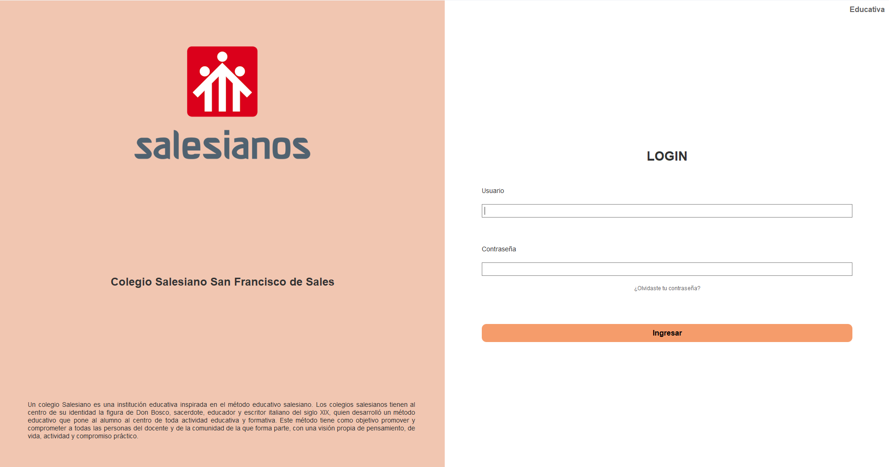

# 🎓 Educativa

**Educativa** es una aplicación de escritorio desarrollada en Java que busca digitalizar y optimizar la gestión académica y administrativa de centros educativos. Está pensada para instituciones de educación primaria, secundaria y formación profesional.

## 📌 Descripción

Esta herramienta centraliza procesos como:

- Gestión de estudiantes, profesores y asignaturas.
- Control de matrículas, asistencia y eventos escolares.
- Administración de becas y generación de reportes como boletines o certificados.
- Automatización de tareas y reducción de errores administrativos.

Educativa proporciona una interfaz gráfica intuitiva y un sistema robusto basado en una arquitectura **MVC**, con tecnologías modernas como **Hibernate**, **MySQL**, **Maven** y **Java Swing**.

Este proyecto está diseñado para ser:
- 🔐 Seguro
- 🔁 Escalable
- 🛠️ Fácil de mantener

Ideal tanto para instituciones reales como para fines académicos o de desarrollo colaborativo.

---

## 🛠 Tecnologías utilizadas

- Java 17
- Maven
- Hibernate ORM
- MySQL
- JavaSwing (diseño de interfaz)
- LGoodDatePicker / JCalendar (selección de fechas)
- Apache PDFBox (generación de PDFs)
- JNA (integración con librerías nativas)

---

## 🚀 Instalación

1. Clona este repositorio:

   ```bash
   git clone https://github.com/SerCast94/educativa.git

## 🖼️ Capturas de pantalla

### Login



### Dashboard o Panel de mando


## 🤝 Contribuir

¡Las contribuciones son bienvenidas!

1. Haz un fork del proyecto.
2. Crea una nueva rama:  
   `git checkout -b feature/nueva-funcionalidad`
3. Realiza tus cambios y haz commit:  
   `git commit -m "Agrega nueva funcionalidad"`
4. Sube tu rama:  
   `git push origin feature/nueva-funcionalidad`
5. Abre un Pull Request.


## 📄 Licencia

Este proyecto se distribuye bajo **uso libre**. Puedes modificarlo, usarlo o distribuirlo sin restricciones.
